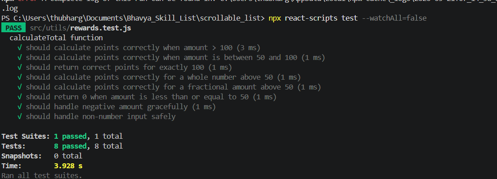
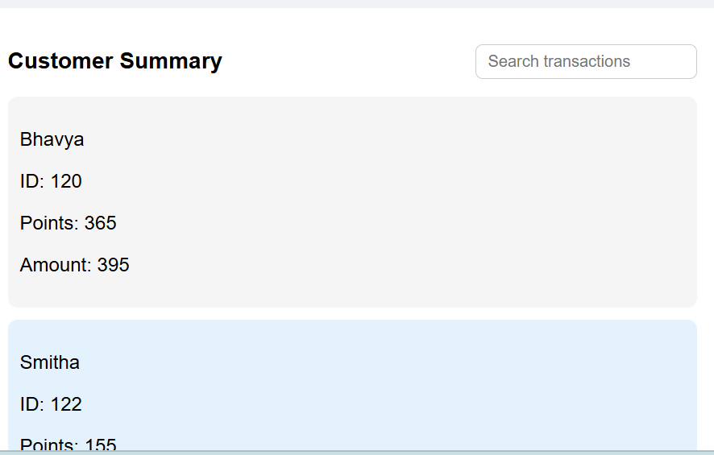
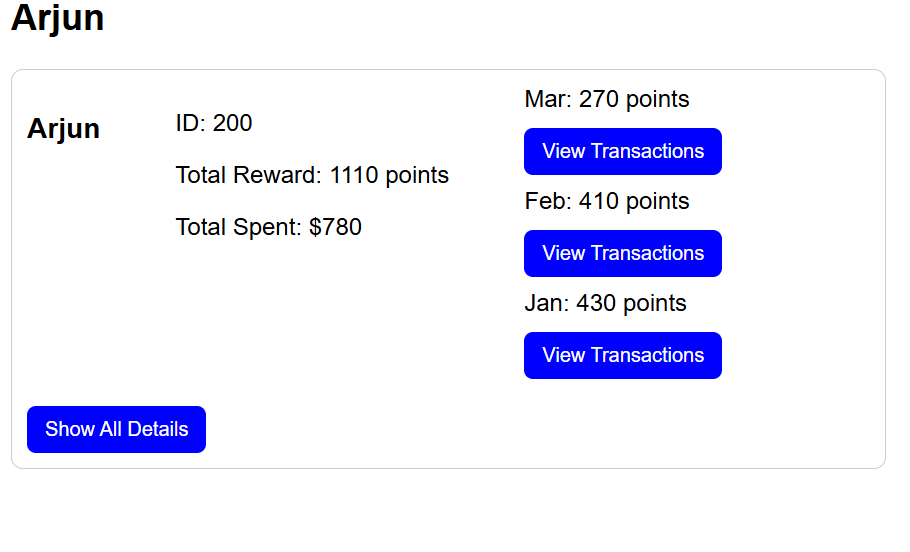
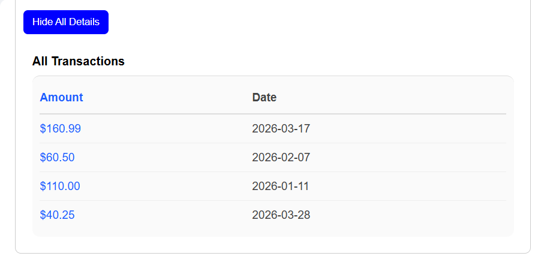

# Scrollable List Rewards Dashboard

A small React application that displays customer reward points and transaction details.

# Project structure

#src/components/DashboardPage.js - Main dashboard view. Loads transactions from the API service, aggregates customers and reward points, toggles customer summary, and passes selected customer data to detail views.

#src/components/CustomerPage.js - Renders selected customer details. Accepts customer props from the dashboard or route parameters, and keeps customer detail rendering separate from dashboard summary logic.

#src/components/CustomerDetails.js - Shows total points, monthly breakdown, customer ID, and transaction details. Includes a simple toggle to show/hide the transaction list.

#src/utils/Rewards.js - Contains reward calculation logic. Aggregates customer totals, monthly points, and transaction arrays. Ensures customer ID and total amount are preserved per customer.

#src/utils/useRewards.js - Custom React hook that memoizes reward aggregation for a transaction list and returns customer reward summaries for dashboard and customer views.

#src/data/transactionData.js - Static transaction data used by the app. Includes `customerID`, `customerName`, `amount`, and `date`.

#src/services/Api.js - Simulates async loading of transaction data with a promise.

# Run the app

Install dependencies:

```bash
npm install
```

Start the app locally:

```bash
npm start
```

#to make tests run
npx react-scripts test --watchAll=false

#TestsPassed


#DashboardPage


#customaer page


#customer Details


#Transaction List view
